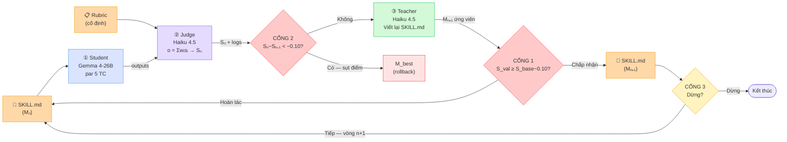
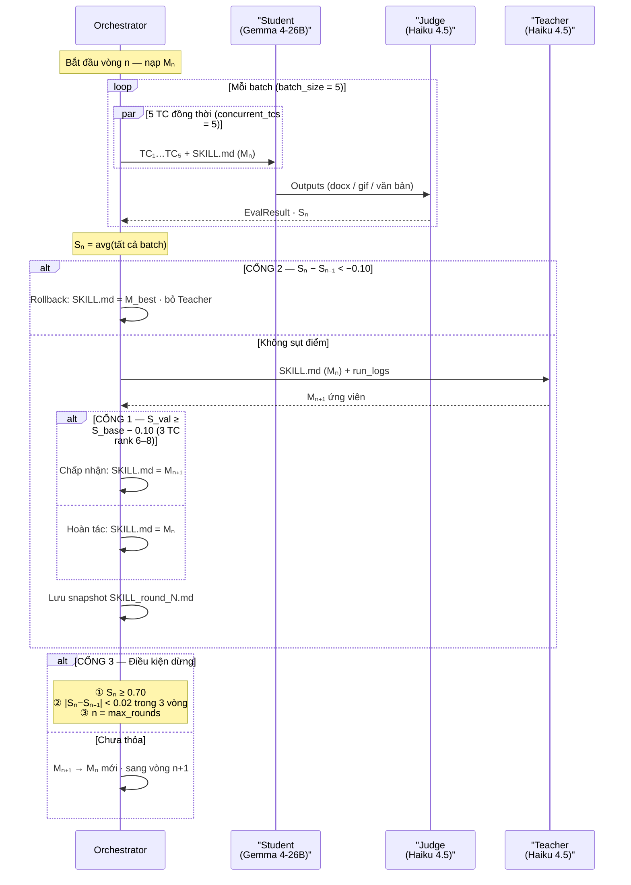
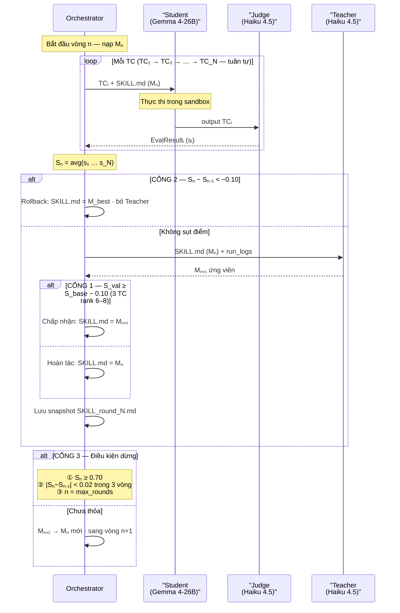
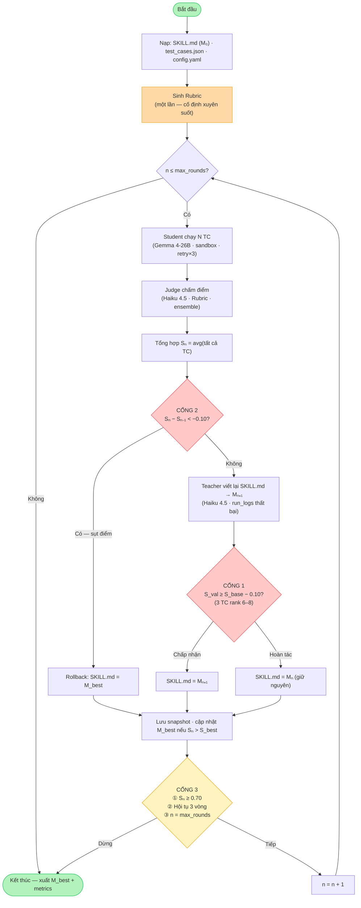
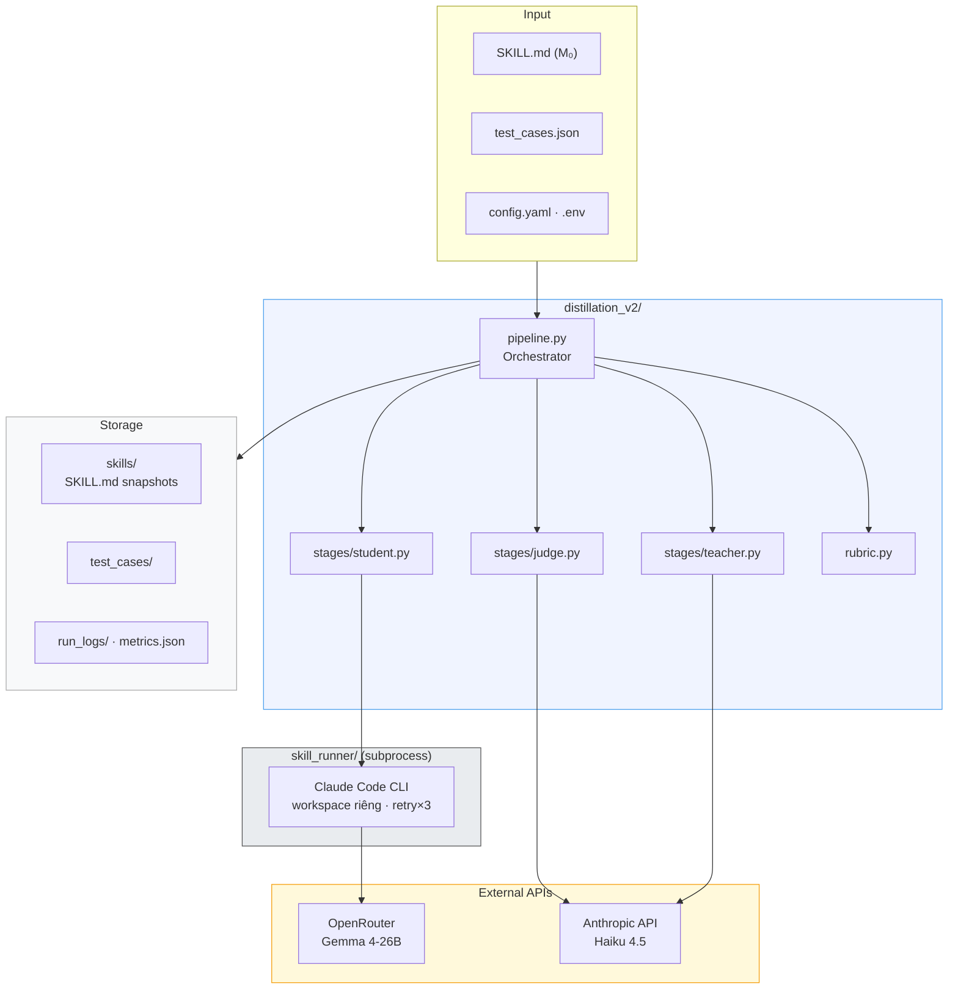

# Mermaid — Bốn biểu đồ kiến trúc pipeline tối ưu SKILL.md

---

## Hình 3.1 — Kiến trúc ba giai đoạn Teacher–Student–Judge

---

## Hình 3.2 — Biểu đồ tuần tự một vòng tối ưu

---

## Hình 3.3 — Biểu đồ tuần tự (chạy từng TC — tuần tự)

---

## Hình 3.4 — Workflow tổng thể

---

## Hình 3.5 — Kiến trúc hệ thống (component view)

---

*Tham số: τ₁ = τ₂ = 0.10 · stop\_threshold = 0.70 · converge\_delta = 0.02 · converge\_k = 3 · batch\_size = 5 · concurrent\_tcs = 5*
