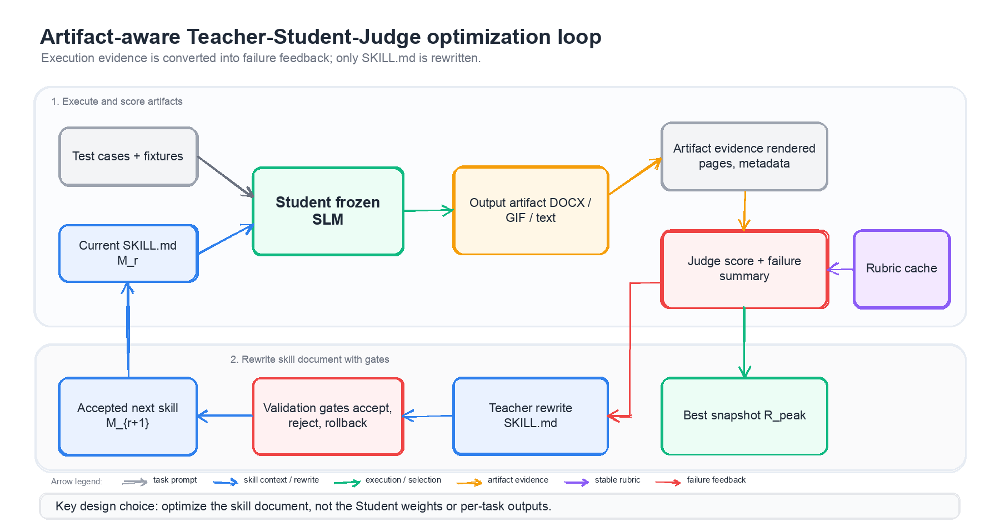
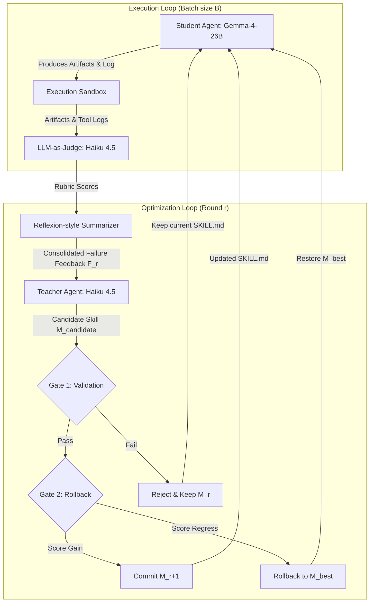
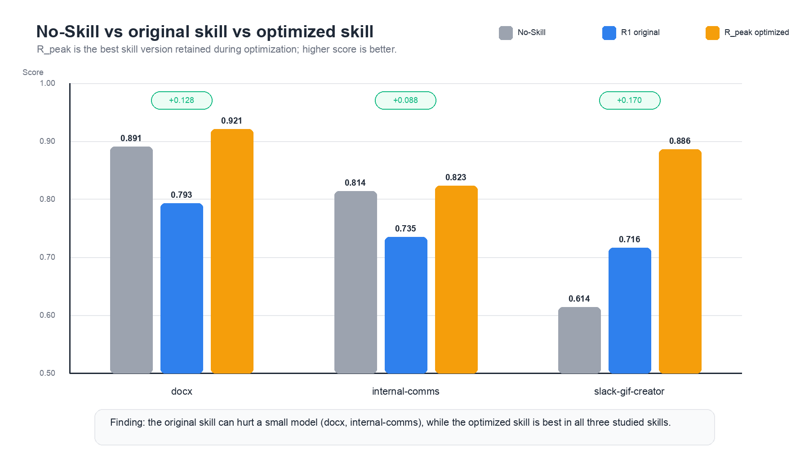

# Language-Level Skill Distillation: Optimizing Agentic Procedural Knowledge for Small Language Models

**Phan Van Toan**
Faculty of Information Technology
The University of Danang - University of Science and Technology
Email: phanvantoan.contact@gmail.com

**Truong Tan Cuong**
Independent Research Collaborator
Email: ctruongtan31070901@gmail.com

---

## Abstract

Agent skills package complex procedural knowledge—such as tool usage guidelines, workflow constraints, and error recovery policies—into reusable natural-language documents (e.g., `SKILL.md`). While these documents are typically authored and validated using frontier large language models, their portability to Small Language Models (SLMs) remains an open challenge. In this paper, we investigate the portability of frontier-authored agent skills to frozen SLMs. We demonstrate a critical *negative transfer* phenomenon, where executing frontier-optimized skills on an SLM yields performance worse than using no skill at all due to instruction-bloat and cognitive overload. To address this, we propose a parameter-free, language-level distillation framework using a closed-loop **Teacher-Student-Judge** architecture.

Our framework optimizes long skill documents through iterative, natural-language rewriting driven by consolidated failure feedback, guarded by candidate validation and round-level rollback gates. We evaluate our method on three artifact-oriented skills (`docx`, `internal-comms`, and `slack-gif-creator`) using a suite of 76 test cases. Across 26 optimization rounds, the best-performing skill versions consistently recover from negative transfer, achieving a mean score improvement of **+0.128** on a 0–1 scale over the original skill baseline—representing a **~17% relative improvement**. Our results suggest that optimizing natural-language procedural instructions is a highly effective, low-cost intervention before considering gradient-based model fine-tuning.

---

## 1. Introduction

Autonomous language-model agents increasingly rely on externalized procedural knowledge to execute multi-step operations. Rather than forcing a model to infer complex tool-use patterns or output formatting requirements from a single task prompt, modern agent architectures inject modular "skills." A prominent realization of this design is Anthropic's Agent Skills, which package instructions, scripts, templates, and execution schemas into a structured `SKILL.md` file. This modularity allows skills to be dynamically loaded under a progressive disclosure model, conserving context window space and standardizing workflows across diverse execution environments (e.g., Claude Code, Cursor, and Gemini CLI).

However, a fundamental portability bottleneck arises: skill documents authored and refined on frontier models (e.g., Claude 3.5 Sonnet, GPT-4o) do not transfer seamlessly to Small Language Models (SLMs, defined here as models containing fewer than 30 billion parameters). Small models exhibit high sensitivity to instruction formatting, step-by-step sequencing, and procedural ambiguity. When forced to consume frontier-optimized, highly verbose skill documents, SLMs frequently suffer from cognitive overload, manifesting as skipped verification steps, malformed tool calls, or "success hallucinations" (wherein the agent reports successful task execution despite failing to produce the required output artifact).

Indeed, our empirical baseline reveals a striking anomaly: on the `docx` skill, the Student SLM (`gemma-4-26b-a4b-it`) achieves a zero-shot score of **0.891** *without* loading any skill, but its score drops precipitously to **0.793** when loaded with the original, frontier-optimized `SKILL.md`. A similar degradation is observed on `internal-comms` (from **0.814** down to **0.735**). This negative transfer implies that loading a default skill document can act as a distractor rather than an enabler, contradicting the assumption that providing more procedural context universally improves agent performance.

Fine-tuning model weights is one approach to resolve this mismatch, but it demands substantial compute resources, curated training trajectories, and the deployment of specialized model checkpoints. A more lightweight, parameter-free alternative is to treat the natural-language skill document itself as a trainable artifact, keeping the target model's parametric weights frozen. While prior work such as SkillOpt has established that natural-language skills can be iteratively optimized using rollout batches, they often rely on simple benchmarks with exact-match text validation.

In this work, we present an empirical case study on optimizing long-form, artifact-heavy agent skills for frozen SLMs. We introduce an automated **Teacher-Student-Judge** framework. In this loop, a frozen Student model executes tasks in a terminal environment; a rubric-based multimodal LLM-as-Judge evaluates the generated artifacts (using rendered page images and file metadata); a Reflexion-style Summarizer consolidates execution logs into failure feedback; and a stronger Teacher model rewrites the `SKILL.md` document. To prevent catastrophic forgetting and drift, the optimization process is protected by a candidate validation gate (evaluating rewrites on threshold-rank tasks) and a round-level rollback gate.

Specifically, we make three main contributions:
1. We document and analyze the **negative transfer** phenomenon, proving that verbose, frontier-optimized skill documents can severely degrade the performance of frozen SLMs.
2. We present a reproducible, parameter-free **Teacher-Student-Judge** framework containing twin verification gates to optimize long-form agent skills directly in the natural-language space.
3. We demonstrate empirical gains across three complex, artifact-oriented skills (`docx`, `internal-comms`, and `slack-gif-creator`) over 26 optimization rounds, yielding a mean score improvement of **+0.128** (an approximate **+17% relative increase**), demonstrating that language-level distillation can recover or exceed zero-shot performance without model retraining.



---

## 2. Background and Related Work

### 2.1 Agent Skills and Procedural Knowledge
Traditional prompt engineering focuses on task-specific instructions passed within a single conversational context. In contrast, agent skills represent reusable procedural blocks designed to be invoked dynamically. Under the progressive disclosure model pioneered by Anthropic, a skill is structured hierarchically across three tiers:
1. **L1 (Metadata):** Read at startup (~100 tokens), containing the YAML frontmatter (`name` and `description`). The description acts as the retrieval prompt used by the router to decide when to activate the skill.
2. **L2 (Body):** The main body of `SKILL.md` (typically $<5,000$ tokens), loaded into the context window only when the skill is retrieved.
3. **L3 (Resources):** Executable helper scripts and static assets (e.g., JSON schemas, template documents) called by the agent dynamically during execution, preventing context bloat.

This separation of concerns is particularly critical for resource-constrained SLMs. However, if the L2 body is poorly structured, small models fail to execute the underlying tool-use contracts, highlighting the need for model-specific optimization of the skill text.

### 2.2 Knowledge Distillation vs. Automatic Prompt Optimization
Traditional Knowledge Distillation (KD) transfers capabilities from a large teacher model to a smaller student model by training the student on soft targets (logits) or synthetic instruction-tuning datasets. This process alters the student's parametric weights.

Conversely, Automatic Prompt Optimization (APO) treats the prompt or instruction set as a set of non-differentiable parameters, searching the discrete space of natural language using task-level feedback. A taxonomy of prominent prompt optimization paradigms compared with our proposed framework is detailed in Table 1.

| Dimension | APE [5] | OPRO [6] | Self-Refine [4] | Reflexion [3] | SkillOpt [1] | **Our Work** |
| :--- | :--- | :--- | :--- | :--- | :--- | :--- |
| **Search Granularity** | Short prompt templates | Instruction strings | Individual output text | Trajectory-level actions | Modular patches (add/del) | **Full-scale `SKILL.md` documents** |
| **Feedback Loop** | Score-based selection | Historical (prompt, score) | Single-turn self-critique | Episodic memory buffer | Rollout failure reflection | **Reflexion-style consolidated logs** |
| **Evaluation Medium** | Exact-match accuracy | Deterministic accuracy | LLM self-evaluation | Environment feedback | Multi-harness verification | **Rubric-based Multimodal Judge** |
| **Weight Updates** | Frozen | Frozen | Frozen | Frozen | Frozen | **Frozen** |
| **Safety Gates** | None | None | None | None | Validation Gate | **Twin Gates (Validation & Rollback)** |

**Table 1:** Taxonomy of related Automatic Prompt Optimization (APO) and skill optimization frameworks.

Our work is conceptually aligned with SkillOpt [1], which treats skill documents as trainable external state for frozen agents. However, while SkillOpt focuses on patch-level edits across synthetic benchmarks, our work tackles long-form `SKILL.md` documents governing complex, artifact-producing tasks. Evaluating these tasks requires rendering output documents to images and validating them against multi-criteria rubrics, introducing subjective dimensions that cannot be captured by simple exact-match string metrics.

---

## 3. Methodology

### 3.1 Problem Formalization
Let $M$ be the natural-language skill document (e.g., `SKILL.md`), and let $T = \{t_1, t_2, \dots, t_{|T|}\}$ be a suite of test cases representing tasks in a specific domain. The Student model, denoted as $\text{Student}(\cdot, \cdot)$, takes the skill $M$ and a test case $t \in T$ as input, executing a series of tool calls in a sandboxed environment to produce a final output artifact $y = \text{Student}(M, t)$.

To evaluate the quality of the generated artifact $y$, we define a rubric-based judge function $Q(y, \text{Rubric}_t) \in [0, 1]$, where $\text{Rubric}_t$ represents a set of multi-criteria guidelines tailored to the task category of $t$. The objective of language-level skill distillation is to find the optimal skill document $M^*$ that maximizes the mean score across the entire test suite, while keeping the parameters of the Student model frozen:

$$\tag{1} M^* = \arg\max_{M} \frac{1}{|T|} \sum_{t \in T} Q\big(\text{Student}(M, t), \text{Rubric}_t\big)$$

Because $\text{Student}(\cdot, \cdot)$ and the judge function $Q(\cdot, \cdot)$ are black-box, non-differentiable language models, we approximate this optimization using an iterative rewriting loop. At round $r$, the skill document is updated as:

$$\tag{2} M_{r+1} = \text{Teacher}(M_r, F_r)$$

where $F_r$ represents a consolidated failure feedback report compiled by a log summarizer over all test cases in round $r$.

---

### 3.2 Teacher-Student-Judge Architecture
The optimization framework consists of three distinct LLM agents operating in a closed loop:



**Figure 1:** Detailed system architecture of the Teacher-Student-Judge optimization loop, demonstrating the interaction between the execution sandbox, the rubric-based evaluator, the log summarizer, and the twin safety gates.

1.  **Student (Execution):** The target agent model being optimized. The Student model receives the current skill $M_r$, reads the task prompt $t$, and executes tool calls (file edits, command executions, verification checks) within a sandboxed terminal environment. In our experiments, we fix the Student as `google/gemma-4-26b-a4b-it` running inside the Claude Code CLI.
2.  **Judge (Evaluation):** A multimodal evaluator that scores the Student's output. To evaluate artifact-producing tasks objectively, the Judge does not merely look at the final text output. For the `docx` skill, the Judge inspects rendered page images of the generated Word document (compiled via LibreOffice and `pdf2image`). For the `slack-gif-creator` skill, the Judge analyzes frame metadata and structural constraints of the output GIF.
    The Judge scores each task according to a stable, pre-cached workflow-specific rubric. For a rubric containing $K$ criteria, the overall score $o$ is computed as the weighted sum:
    $$\tag{3} o = \sum_{i=1}^K w_i \cdot s_i \quad \text{subject to} \quad \sum_{i=1}^K w_i = 1$$
    where $s_i \in [0, 1]$ is the score assigned to criterion $i$, and $w_i$ is its normalized weight. To minimize stochasticity and cognitive bias, the system supports a median ensemble of $N$ judge calls:
    $$\tag{4} q(t) = \text{median}\left\{ o^{(1)}, o^{(2)}, \dots, o^{(N)} \right\}$$
    where $N = 1$ is used in our default experimental runs. A task is classified as *passed* if $q(t) \ge 0.8$, though this binary verdict does not guide the optimization process directly.
3.  **Teacher (Optimization):** An optimization agent that analyzes the current skill $M_r$ and the consolidated failure report $F_r$, subsequently outputting a revised skill document $M_{r+1}$. The Teacher and Judge are powered by `claude-haiku-4-5`. Crucially, the Teacher is called only once per round (after evaluating all batches) to ensure it acts on aggregated, statistically sound execution evidence rather than overfitting to individual task failures.

---

### 3.3 Safety Gates and Rollback Mechanisms
To prevent the Teacher from introducing regressions or deleting critical instructions that were previously effective, we implement two distinct validation barriers.

#### Gate 1: Candidate Validation
Immediately after the Teacher generates a candidate skill $M_{\text{candidate}}$, we perform a localized validation check. We rank the test cases from the previous round by score and select a validation subset of size $V = 3$ composed of tasks holding **ranks 6 to 8** (the threshold rank). Evaluating at the threshold rank ensures we target tasks that are sensitive to instruction quality—avoiding trivial tasks that always pass or extremely difficult tasks that always fail.

We run the Student on this validation subset using $M_{\text{candidate}}$ to compute a validation score $S_{\text{val}}$. The candidate is accepted and written to disk only if:

$$\tag{5} S_{\text{val}} \ge S_{\text{base}} - \tau_1$$

where $S_{\text{base}}$ is the score of those same validation tasks in the previous round, and $\tau_1 = 0.10$ is the tolerance threshold. If Eq. (5) is violated, the candidate is rejected, and the system reverts to $M_r$, forcing the Teacher to regenerate the rewrite in the next round with updated feedback.

#### Gate 2: Round Rollback
After a full optimization round $r$ is completed and evaluated across the entire test suite $T$, the mean round score $S_r$ is computed:

$$\tag{6} S_r = \frac{1}{|T|} \sum_{t \in T} q_r(t)$$

If the overall score drops significantly compared to the previous round, we trigger a hard rollback to the historical best-performing skill version $M_{\text{best}}$:

$$\tag{7} M_{r+1} = \begin{cases} M_{\text{best}} & \text{if } S_r - S_{r-1} < -\tau_2 \\ \text{Teacher}(M_r, F_r) & \text{otherwise} \end{cases}$$

where $\tau_2 = 0.10$ is the rollback threshold. When a rollback is triggered, the Teacher call for that round is skipped, ensuring the optimization trajectory resumes from a stable, high-performing checkpoint.

---

### 3.4 Algorithm Pseudocode
The complete natural-language skill distillation process is detailed in Algorithm 1.

```text
Algorithm 1: Teacher-Student-Judge Skill Document Optimization
--------------------------------------------------------------------------------
Input  : Test suite T, Initial skill M_0, Max rounds R_max,
         Validation threshold tau_1, Rollback threshold tau_2, Task Rubrics
Output : Optimized skill document M_best

1: M_best <- M_0
2: S_best <- 0
3: M_current <- M_0
4:
5: for r = 1 to R_max do
6:     // Step 1: Execute test suite with current skill
7:     for each t in T do
8:         y_t <- Student(M_current, t) in Sandbox Environment
9:         q_t <- Evaluate y_t using Judge(y_t, Rubric_t)
10:    end for
11:    S_r <- Mean of q_t for all t in T
12:
13:    // Step 2: Track historical best
14:    if S_r > S_best do
15:        S_best <- S_r
16:        M_best <- M_current
17:    end if
18:
19:    // Step 3: Check Gate 2 (Round Rollback)
20:    if r > 1 and (S_r - S_{r-1} < -tau_2) do
21:        M_current <- M_best
22:        continue // Skip Teacher rewrite, resume from best
23:    end if
24:
25:    // Step 4: Summarize failures and invoke Teacher
26:    F_r <- SummarizeLogs(T, q_t, StudentLogs)
27:    M_candidate <- Teacher(M_current, F_r)
28:
29:    // Step 5: Check Gate 1 (Candidate Validation)
30:    T_val <- SelectThresholdTasks(T, q_t, count=3)
31:    S_val_base <- Mean score of T_val under M_current
32:
33:    for each t in T_val do
34:        y_val_t <- Student(M_candidate, t)
35:        q_val_t <- Judge(y_val_t, Rubric_t)
36:    end for
37:    S_val_candidate <- Mean of q_val_t
38:
39:    if S_val_candidate >= S_val_base - tau_1 do
40:        M_current <- M_candidate // Accept rewrite
41:    else
42:        M_current <- M_current   // Reject, keep previous version
43:    end if
44: end for
45:
46: return M_best
--------------------------------------------------------------------------------
```

---

## 4. Experimental Setup

### 4.1 Target Skills and Test Cases
We select three real-world skills from the `anthropics/skills` repository. These skills are chosen to represent diverse output modalities (binary assets, formatted office documents, and free-form text) and distinct error profiles.

1.  **`docx` (26 Test Cases):** Governs the creation, editing, structural parsing, and format conversion of Word documents using the `docx-js` library. Evaluation relies heavily on visual verification by rendering the `.docx` file pages to PNG images.
2.  **`internal-comms` (27 Test Cases):** Requires generating structured text communications (incident reports, status updates, post-mortems). The evaluation evaluates soft constraints such as tone, vocabulary, severity classifications, and structural completeness.
3.  **`slack-gif-creator` (23 Test Cases):** Requires synthesizing, optimizing, and composing GIF images. It has strict, binary-like technical constraints (dimension limits, frame rates, file sizes).

To measure performance across different task behaviors, the 76 test cases are distributed across five distinct workflows (Table 2).

| Workflow Category | Description | `docx` | `internal-comms` | `slack-gif-creator` | **Total** |
| :--- | :--- | :---: | :---: | :---: | :---: |
| **Create** | Generate a new artifact from natural-language specs | 10 | 10 | 10 | **30** |
| **Read / Extract** | Parse input artifacts and output structured metadata | 4 | 4 | 3 | **11** |
| **Edit** | Modify an existing artifact based on revision prompts | 5 | 4 | 2 | **11** |
| **Convert / Validate** | Transform file formats or run post-creation checks | 2 | 4 | 4 | **10** |
| **Edge Cases** | Handle ambiguous inputs, contradictions, or failures | 5 | 5 | 4 | **14** |
| **Total** | | **26** | **27** | **23** | **76** |

**Table 2:** Task workflow distribution across the three evaluated skills.

---

### 4.2 Baselines and Runtime Parameters
We compare the performance of the Student model under three distinct conditions:
*   **No-Skill:** The Student executes the task prompts without loading the `SKILL.md` document or its associated execution scripts. This serves as the zero-shot baseline.
*   **Original Skill (R1):** The Student executes the tasks using the default, unmodified `SKILL.md` provided in the Anthropic repository.
*   **Optimized Skill ($R_{\text{peak}}$):** The best-performing skill version identified during the optimization process.

The system is configured with a batch size of 5, a maximum of 10 optimization rounds, and safety gate thresholds $\tau_1 = \tau_2 = 0.10$. All runs are executed using OpenRouter API routing. To ensure runtime consistency, we disable the Claude Code CLI's default context compression feature (`autoCompactEnabled = false`), which would otherwise silently compress logs using a frontier model and compromise the validity of the SLM evaluation.

---

## 5. Results and Evaluation

### 5.1 Quantitative Optimization Results
Across all three skills, our language-level distillation loop yields significant performance improvements (Table 3).

| Skill | Rounds | No-Skill | Original (R1) | **Optimized ($R_{\text{peak}}$)** | Final ($R_{\text{final}}$) | **Abs. Gain** ($\Delta S_{\text{abs}}$) | **Rel. Gain** ($\Delta S_{\text{rel}}$) | **Peak-to-Final** |
| :--- | :---: | :---: | :---: | :---: | :---: | :---: | :---: | :---: |
| `docx` | 8 | 0.891 | 0.793 | **0.921** (R5/R7) | 0.877 | +0.128 | +16.2% | -0.044 |
| `internal-comms` | 8 | 0.814 | 0.735 | **0.823** (R3) | 0.822 | +0.088 | +11.9% | -0.001 |
| `slack-gif-creator` | 10 | 0.614 | 0.716 | **0.886** (R9) | 0.865 | +0.169 | +23.6% | -0.020 |
| **Mean** | — | **0.773** | **0.748** | **0.877** | **0.855** | **+0.128** | **~+17%** | **-0.022** |

**Table 3:** Primary quantitative results comparing the No-Skill, Original (R1), and Optimized ($R_{\text{peak}}$) scores.

The average score across the three domains increases from **0.748** at R1 to **0.877** at peak, corresponding to a relative gain of **~17%**. The largest improvement is observed in the technically constrained `slack-gif-creator` skill (+23.6% relative gain). For `docx`, the peak score of **0.921** is achieved at both Round 5 and Round 7, demonstrating that the optimized state is highly stable and reproducible.

The step-by-step scoring trajectories for all rounds are visualized in Figure 2.

```
Score (0-1)
  1.00 |
  0.95 |                               * [docx Peak: 0.921]
  0.90 |                         *---*       *
  0.85 |             *---*---*               \---* [docx Final: 0.877]
  0.80 |   * [R1: 0.793]                          \
  0.75 |   |                 * [slack Peak: 0.886] \
  0.70 |   *                 |               *---*  * [slack Final: 0.865]
  0.65 |   \                 \       *-------/
  0.60 |    \---*             \-----/
  0.55 |         \---*---*
  0.50 |__________________________________________________
           R1   R2   R3   R4   R5   R6   R7   R8   R9  R10
```
**Figure 2:** Performance trajectories over optimization rounds for `docx` (solid line) and `slack-gif-creator` (dashed line).



---

### 5.2 Deconstructing Negative Transfer
The no-skill baseline results in Table 3 reveal a critical finding: **original frontier-optimized skills can harm SLM performance.**

On the `docx` skill, the Student model performs substantially better *without* the skill (0.891) than with the original R1 skill (0.793). A similar behavior occurs in `internal-comms` (0.814 zero-shot vs. 0.735 at R1).

Analyzing the execution logs shows that this negative transfer is driven by **instruction dilution**. The original `SKILL.md` files are highly detailed and require the agent to execute multiple self-reflective verification checks. While beneficial for larger models, these instructions consume the SLM's limited context attention. The student gets "lost in the middle," prioritizing formatting minutiae over core task requirements or generating malformed XML syntax in a confused attempt to satisfy overlapping guidelines.

Our optimization loop recovers from this degradation. For `docx`, the optimized skill reaches **0.921**, exceeding both the original skill and the zero-shot baseline. For `slack-gif-creator` (where zero-shot capability is low due to the strict necessity of invoking shell scripts in a specific order), the optimized skill amplifies the model's performance to **0.886**, showing that when a skill is structurally required, proper tuning is essential.

---

### 5.3 Qualitative Analysis: Case Studies of Teacher Edits
The numerical improvements correlate directly with specific, interpretable modifications introduced by the Teacher model. We present three representative diff case studies.

#### Case Study 1: Resolving Success Hallucinations in `docx` (R1 $\rightarrow$ R2, +4.8% Score)
In early rounds, the Student frequently reported successful document generation while failing to output any file due to hidden execution crashes. The Teacher modified `SKILL.md` to introduce explicit postconditions and fallback rules for the Table of Contents (TOC) engine:

```diff
+ ## Critical TOC Construction Guidelines
+ - Ensure all document headings utilize explicit `HeadingLevel` constants rather than custom paragraph styles. The Word TOC generator will fail to parse custom XML outline levels.
+ - **Verification Postcondition**: Immediately after saving the file, execute a shell command to verify the presence of `word/document.xml` within the output ZIP package.
+ - **Fallback Protocol**: If the TOC generator throws a structural error, revert to an outline-level mapping strategy and attempt a direct XML insertion.
```

#### Case Study 2: Injecting Technical Postconditions in `slack-gif-creator` (R3 $\rightarrow$ R4, +10.3% Score)
The student frequently failed GIF creation due to incorrect sizing or frame count constraints. The Teacher resolved these issues by changing vague quality instructions into strict technical boundaries:

```diff
+ ## Strict Format and Output Limitations
+ - Target dimensions MUST match the Slack canvas exactly:
+   - Standard emoji/reactions: 128x128 pixels (No exceptions).
+   - Standard chat messages: 480x480 pixels.
+ - **Mandatory Verification Step**: You MUST execute `validate_gif()` via the CLI after every file write. Parse the stdout logs; if any warning regarding frame-count or layout size is returned, delete the file and regenerate.
```

#### Case Study 3: Template Over-Bloating in `internal-comms` (R1 $\rightarrow$ R8, Document Size $\times 5$)
For `internal-comms`, the Teacher continually added specific markdown templates for distinct incident reports (e.g., severity levels, system impacts). The skill document expanded from 4,000 characters to over 21,500 characters.

Surprisingly, this dramatic expansion did not yield corresponding performance gains (+0.088 absolute gain at peak). The model plateaued early (Round 3) and suffered minor score regressions in later rounds. This confirms that text-level optimization has a clear utility ceiling: adding more text eventually dilutes the SLM's attention, reverting the skill into a distractor.

---

### 5.4 Optimization Convergence and Overfitting
The score trajectories (Table 3) reveal that optimization is non-monotonic. All three skills reached a peak performance level and subsequently regressed: `docx` dropped by **-0.044** from its peak at R8; `slack-gif-creator` dropped by **-0.020** at R10.

This regression represents **rubric overfitting**. In later rounds, the Teacher adjusts the instructions to satisfy specific rubric criteria flagged in the consolidated failure feedback $F_r$. However, in doing so, it occasionally compromises the generality of the skill document, introducing regressions on tasks that were previously solved. This behavior reinforces the need for validation gates and early stopping criteria rather than deploying the final round's output.

---

## 6. Discussion

### 6.1 Why Small Models Benefit from Procedural Simplification
Our analysis shows that small language models process natural-language instructions differently than frontier models. While a model like Claude 3.5 Sonnet excels at parsing verbose, highly nested prompt trees containing abstract guidelines, Gemma-4-26B requires:
1.  **Technical Postconditions over Self-Reflection:** Abstract instructions like *"Make sure the layout looks professional"* cause SLMs to fail. In contrast, concrete postconditions like *"Run the validation script and check that the width is exactly 480px"* yield reliable execution.
2.  **Explicit Fallback Chains:** Smaller models cannot plan dynamic recovery paths on the fly. They benefit significantly from explicit *"If X fails, execute Y instead"* statements.
3.  **Strict File Scoping:** Verbose instructions dilute the attention map. The optimal skill document for an SLM is highly condensed, focusing on tool-calling contracts and syntax examples while moving descriptive explanations to external assets.

---

### 6.2 The Theoretical Ceiling of Language-Level Optimization
We identify a class of systematic failures that language-level distillation cannot resolve. On the `docx` skill, test case `tc_b02` (requiring the model to read a Word table and parse it into structured JSON) scored **0.00 across all 8 optimization rounds**. Similarly, `internal-comms/tc_e05` (handling user prompts that explicitly contradict the skill rules) showed no improvement.

These failures are bounded by the Student's **parametric capacity** and the environment limits. When a model lacks the basic reasoning capacity to parse nested tables or resolve conflicting logic, no amount of prompt modification can recover performance. In these scenarios, researchers must transition from prompt optimization to gradient-based supervised fine-tuning (SFT) or reinforcement learning (RL).

---

### 6.3 Self-Preference and Judge Bias
A key threat in LLM-as-Judge setups is model family bias. Because both our Teacher (optimizer) and Judge (evaluator) are powered by Claude Haiku 4.5, there is a risk that the observed +17% score improvement reflects "conversational alignment"—the Teacher learning to write in a style that the Judge model is biased to score highly, without necessarily improving the underlying quality of the generated artifacts.

To mitigate this threat, we incorporated deterministic artifact verifiers (image rendering and metadata checks) into the Judge's input context. However, decoupling the Teacher and Judge models (e.g., using a GPT-4o Judge and a Claude Teacher) remains a critical baseline for verifying the absolute transferability of the optimized skills.

---

## 7. Threats to Validity

1.  **No Independent Held-Out Test Split:** Due to the limited size of the available test suites (76 cases total), we optimized and evaluated on the same task pool. Although the twin safety gates mitigate overfitting, the peak scores reported here likely contain some training-set optimistic bias. Future work must validate these optimized skills on held-out test splits.
2.  **Judge Stochasticity:** The Judge was executed at a non-zero temperature with an ensemble size of $N = 1$. Re-running the evaluation on identical output artifacts revealed minor score fluctuations (e.g., a variance of $\pm 0.03$ on the `slack-gif-creator` baseline). Zero-temperature judging or larger ensemble sizes ($N \ge 3$) are required for strict mathematical consensus.
3.  **Single Student Model:** Our findings are based on `gemma-4-26b-a4b-it`. We cannot guarantee that a skill document optimized for Gemma will transfer effectively to other SLMs (e.g., Llama-3-8B or Qwen-2.5-7B). Cross-model portability testing is an important future research direction.

---

## 8. Conclusion and Future Work

This paper presented an empirical study of language-level skill distillation for Small Language Models using an automated Teacher-Student-Judge loop. We exposed the negative transfer phenomenon, proving that unmodified frontier-optimized skills can degrade SLM performance compared to zero-shot execution. By optimizing the natural-language skill documents over 26 rounds, our framework achieved a +17% relative score improvement (+0.128 absolute), successfully recovering from negative transfer and demonstrating that procedural simplification can substitute for model training.

Our work yields a practical recommendation: before committing resources to fine-tune an agent model, developers should first evaluate the compatibility of the skill documents with the target SLM and apply structured, parameter-free optimization to the procedural text.

Future research will expand the scope of this work by:
1.  Decoupling the Teacher and Judge models to isolate and measure self-preference bias.
2.  Evaluating cross-model skill portability across a wider array of open-weights SLMs.
3.  Developing bounded patch-level edit mechanisms to target specific failure points without increasing the overall document length.

---

## References

[1] Yifan Yang, Ziyang Gong, Weiquan Huang, Qihao Yang, Ziwei Zhou, Zisu Huang, Yan Li, Xuemei Gao, Qi Dai, Bei Liu, Kai Qiu, Yuqing Yang, Dongdong Chen, Xue Yang, and Chong Luo. 2026. *SkillOpt: Executive Strategy for Self-Evolving Agent Skills*. arXiv:2605.23904.

[2] Lianmin Zheng, Wei-Lin Chiang, Ying Sheng, Siyuan Zhuang, Zhanghao Wu, Yonghao Zhuang, Zi Lin, Zhuohan Li, Dacheng Li, Eric P. Xing, Hao Zhang, Joseph E. Gonzalez, and Ion Stoica. 2023. *Judging LLM-as-a-Judge with MT-Bench and Chatbot Arena*. arXiv:2306.05685.

[3] Noah Shinn, Federico Cassano, Edward Berman, Ashwin Gopinath, Karthik Narasimhan, and Shunyu Yao. 2023. *Reflexion: Language Agents with Verbal Reinforcement Learning*. NeurIPS.

[4] Aman Madaan, Niket Tandon, Prakhar Gupta, Skyler Hallinan, Luyu Gao, Sarah Wiegreffe, et al. 2023. *Self-Refine: Iterative Refinement with Self-Feedback*. NeurIPS.

[5] Yongchao Zhou, Andrei Ioan Muresanu, Ziwen Han, Keiran Paster, Silviu Pitis, Harris Chan, and Jimmy Ba. 2023. *Large Language Models Are Human-Level Prompt Engineers*. ICLR. arXiv:2211.01910.

[6] Chengrun Yang, Xuezhi Wang, Yifeng Lu, Hanxiao Liu, Quoc V. Le, Denny Zhou, and Xinyun Chen. 2024. *Large Language Models as Optimizers*. arXiv:2309.03409.

[7] Jeffrey Zhou, Tianjian Lu, Swaroop Mishra, Siddhartha Brahma, Sujoy Basu, Yi Luan, Denny Zhou, and Le Hou. 2023. *Instruction-Following Evaluation for Large Language Models*. arXiv:2311.07911.

[8] Shishir G. Patil et al. 2024. *Berkeley Function-Calling Leaderboard*. https://gorilla.cs.berkeley.edu/leaderboard.html

[9] Lilian Weng. 2023. *LLM Powered Autonomous Agents*. Lil'Log. https://lilianweng.github.io/posts/2023-06-23-agent/

[10] SkillsBench authors. 2026. *SkillsBench: Benchmarking How Well Agent Skills Work Across Diverse Tasks*. arXiv:2602.12670.
